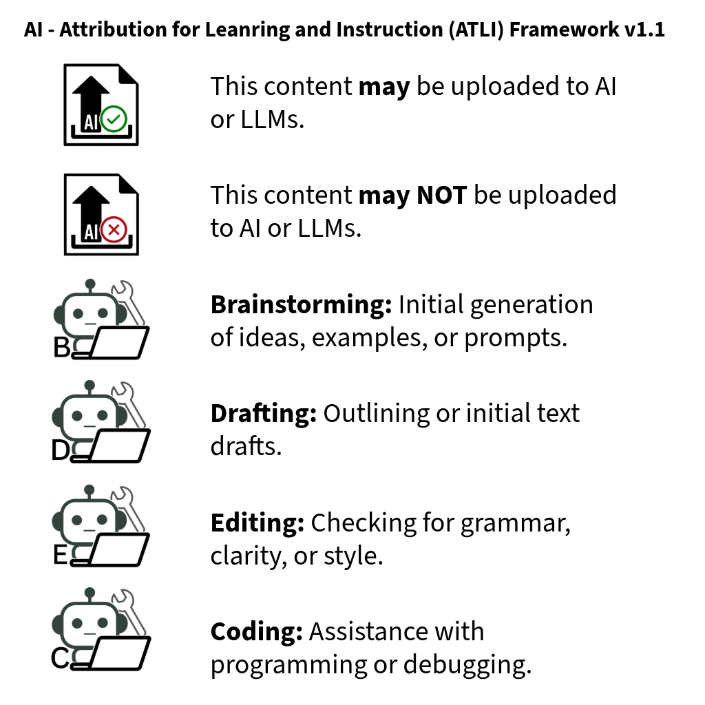

# ai-atli

_atli_ (Nahuatl) - to drink water

This repository, AI ATtribution for Learning &amp; Instruction (AI-ATLI), aims to provide transparent and reproducible ways to documenting how AI tools were used in the development of both instruction and learning materials in education. This project was motivated by a need in education as well as influenced by Open Education Resources (OER) and Creative Commons. Attribution is separated into two main categories: AI Permissions and AI Creation. Each category has an associated icon that is also included in this repository.

**If you use these materials, please cite the repository.**

## AI-ATLI Icons and Summary

All icons created by _Bethany Hernandez-Torres_.

## AI - Attribution for Leanring and Instruction (ATLI) Framework v1.0

### AI Permissions

AI Permissions refer to whether or not content may be uploaded to AI and are summarized in two categories. 

| Category | Description |
|---|---|
| AI-OK | This content **may** be uploaded to AI or LLMs. |
| AI-NO | This content **may NOT** be uploaded to AI or LLMs. |

### AI Creation

This repository uses a four-category attribution system describing how
AI tools were used during development.

| Category | Description |
|---|---|
| Brainstorming | Initial generation of ideas, examples, or prompts. |
| Drafting | Outlining or initial text drafts. |
| Editing | Checking for grammar, clarity, or style. |
| Coding | Assistance with programming or debugging. |

## Transparency Statement

AI tools were used in the development of some materials in this
repository. Specifically, the Drafting and Editing categories were suggested for using AI in writing.

- AI Tool: ChatGPT (OpenAI)
- Model: GPT-5
- Date Used: 2026-03
- Assistance Categories: Brainstorming
- Human Role: All output reviewed, modified, and validated by the author.

## GitHub Pages Prototype

This branch includes a static GitHub Pages prototype that demonstrates how
students or instructors could generate an AI-ATLI attribution statement in a
browser.

### What the prototype does

- Presents the AI Permissions and AI Creation framework in a public-facing format.
- Lets users choose categories and enter tool, model, date, and human review details.
- Generates copy-ready plain text and Markdown attribution statements.

### Publishing on GitHub Pages

Because the site is plain HTML, CSS, and JavaScript, it can be deployed
directly from the repository without a build step.

1. Push the branch to GitHub.
2. In repository settings, open Pages.
3. Set the source to deploy from the selected branch and the repository root.
4. Publish the site.
